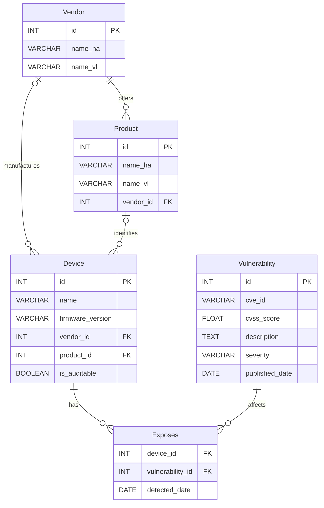

<!-- PROJECT LOGO -->
<br />
<div align="center">
  <a href="https://github.com/github_username/repo_name">
    
  </a>

<h1 align="center">IoT-VulnMap</h1>
  <p align="center">
   A threat intelligence tool that automatically detects vulnerabilities in IoT devices registered in Home Assistant
</p>
</div>


<!-- TABLE OF CONTENTS -->
<details>
  <summary>Table of Contents</summary>
</details>


<!-- ABOUT THE PROJECT -->

## About The Project

[![Product Name Screen Shot][product-screenshot]](https://example.com)

IoT devices are increasingly present in our homes, yet their security is rarely monitored. **IoT-VulnMap** bridges this
gap by connecting to a local [Home Assistant](https://www.home-assistant.io) instance, extracting the list of registered
devices, and cross-referencing them against [CIRCL's Vulnerability Lookup API](https://vulnerability.circl.lu/) to
identify known CVEs.

### Built With

[![Python][Python.org]][Python-url]

---
<!-- HOW IT WORKS -->
## How it works

The application follows a 4-step pipeline:

1. **Discovery :** <br>
2. **Normalization :** <br>
3. **Audit :** <br>
4. **Storage :** <br>

A device is considered **auditable** if it has a known vendor, a known product, and a firmware version, all successfully
mapped to CIRCL's naming convention.

### Key technical choices

#### Database schema design



#### Fuzzy matching

#### Pre-established mappings

#### Auditable vs non-auditable

### Difficulties encountered

#### Vendor normalization

When retrieving IoT data from Home-Assistant, we found that vendors were not standardized. For example, "Amazon" could 
be written in different ways such as "Amazon.com", "Amazon Inc.", etc. However, in the vulnerability lookup API, each 
vendor is uniquely standardized. Therefore, we had to create a mapping table to standardize the vendors and avoid 
duplicates in our database. We also had to create a normalization function that retrieves the vendors as they are found 
in the vulnerability lookup API and associates them with the vendors present in our database. This task was complex and 
required particular attention to ensure that the data was properly aligned with the standards of the vulnerability 
lookup API.

#### Product normalization

As the same for vendors, products were not standardized in the data retrieved from Home-Assistant. For example, a 
product like "Echo Dot" could be referenced in different ways such as "Echo Dot 3rd Gen", "Amazon Echo Dot", etc. This 
posed a similar problem to that of vendors, as the vulnerability lookup API uses standardized product names to perform 
vulnerability searches. Therefore, we had to create a mapping table for products to ensure that the product names in our
database were aligned with those used by the vulnerability lookup API. This task was particularly complex due to the 
wide variety of IoT products and the different ways they can be referenced. Of course, they might be mistakes in the 
mapping tables, which could lead to some devices not being properly assessed for vulnerabilities.

#### Vulnerability parsing

When retrieving vulnerability data from the vulnerability lookup API, we encountered difficulties in parsing the
vulnerability information. The API returns a large amount of data for each vulnerability, including the CVE ID, 
CVSS score, description, severity, and published date. However, the format of this data can vary, and some fields may 
be missing or incomplete. Also, we have to compare firmware versions and published dates to determine if a vulnerability 
is relevant for a specific device, which can be complex due to the variety of formats used for firmware versions and 
dates. 

##TODO : EXPLIQUER FINALEMENT COMMENT ON A FAIT

### Axes of improvement

#### Global user interface
To improve the user experience, we could consider developing a web-based interface that allows users to easily view and
manage the vulnerabilities detected in their IoT devices. This interface could provide a dashboard that displays the 
list of registered devices, their associated vulnerabilities, and relevant information such as CVE IDs, CVSS scores,
descriptions, etc. Additionally, we could implement features such as filtering and sorting options to help users quickly 
identify the most critical vulnerabilities and prioritize their remediation efforts. We could also consider integrating 
the interface with Home Assistant to allow users to receive real-time notifications about new vulnerabilities detected 
in their devices and provide recommendations for mitigation.

#### Data recovery

To improve data retrieval, we could consider using web scraping techniques to extract additional information about IoT 
products from online sources such as manufacturer websites, discussion forums, etc. This would allow us to enrich our
database with additional information about the products, such as technical specifications, user reviews, etc. 
Additionally, we could implement an automatic update system to ensure that our database remains up-to-date with the 
latest information on IoT products and their associated vulnerabilities.

<p align="right">(<a href="#readme-top">back to top</a>)</p>

---
<!-- GETTING STARTED -->

## Getting Started

This is an example of how you may give instructions on setting up your project locally.
To get a local copy up and running follow these simple example steps.

### Prerequisites

The only requirement to run this project is to have **Docker** and **Docker Compose** installed on your machine.

* Docker Compose
  ```sh
  docker compose version
  ```

### Installation

---
<!-- CONTRIBUTORS -->

## Contributors:

<!-- MARKDOWN LINKS & IMAGES -->


<!-- Shields.io badges. You can a comprehensive list with many more badges at: https://github.com/inttter/md-badges -->

[Python.org]: https://img.shields.io/badge/python-3670A0?style=for-the-badge&logo=python&logoColor=ffdd55

[Python-url]: https://www.python.org/