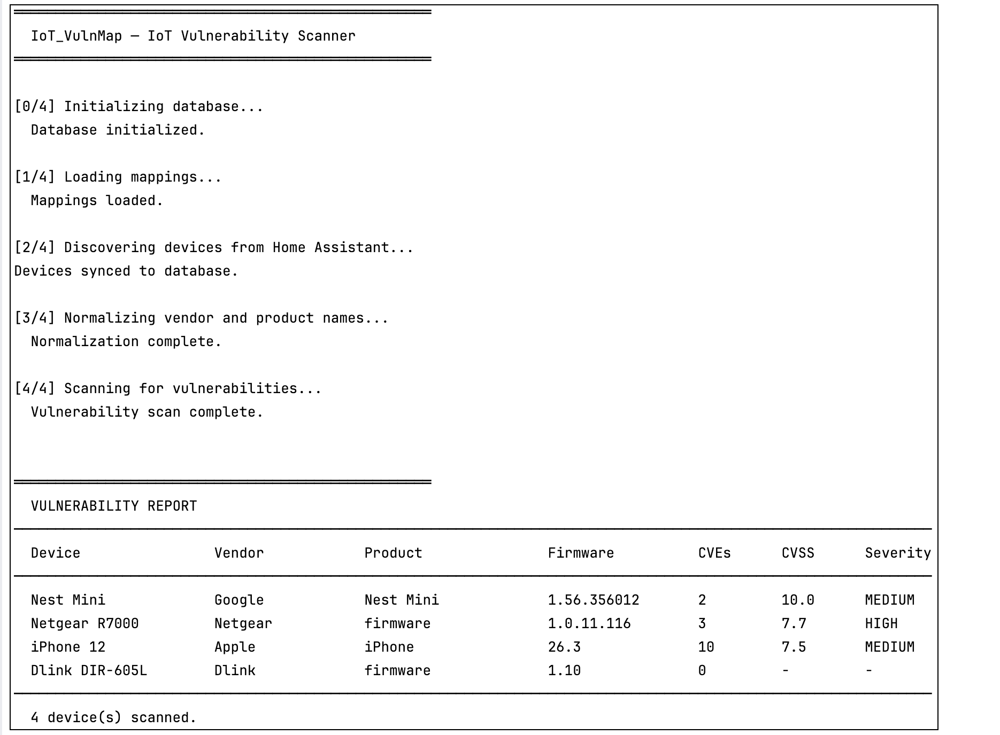
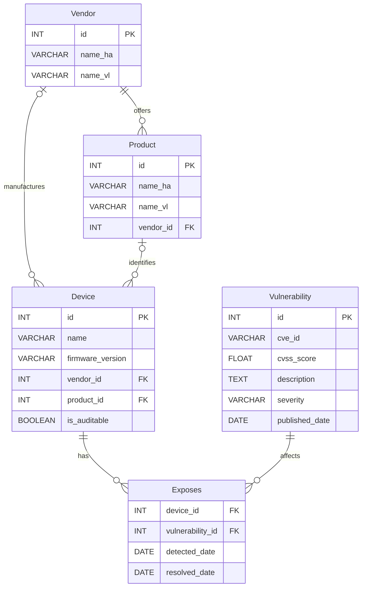

<div>
    
    <h1>IoT-VulnMap</h1>
    <p>A threat intelligence tool that automatically detects vulnerabilities in IoT devices registered in Home Assistant</p>
    <br>
</div>

<!-- TABLE OF CONTENTS -->

## Table of Contents

- [About The Project](#about-the-project)
- [How it works](#how-it-works)
    - [Global functioning](#global-functioning)
    - [Key technical choices](#key-technical-choices)
    - [Difficulties encountered](#difficulties-encountered)
    - [Axes of improvement](#axes-of-improvement)
- [Getting Started](#getting-started)
    - [Prerequisites](#prerequisites)
    - [Project structure](#project-structure)
    - [Installation](#installation)
- [Contributors](#contributors)

<!-- ABOUT THE PROJECT -->

## About The Project



IoT devices are increasingly present in our homes, yet their security is rarely monitored. **IoT-VulnMap** bridges this
gap by connecting to a local [Home Assistant](https://www.home-assistant.io) instance, extracting the list of registered
devices, and cross-referencing them against [CIRCL's Vulnerability Lookup API](https://vulnerability.circl.lu/) to
identify known CVEs.

### Built With

[![Python][Python.org]][Python-url]

---
<!-- HOW IT WORKS -->

## How it works

### Global functioning

The application follows a 4-step pipeline:

1. **Discovery :** <br>
   The goal of this first step is to retrieve the list of devices registered in Home Assistant, along with their
   associated
   information such as vendor, product, and firmware version. This information is crucial for the subsequent steps of
   normalization and vulnerability assessment. The discovery process involves connecting to the Home Assistant instance,
   extracting the relevant data about the devices, and storing it in the database.

2. **Normalization :** <br>
   The second step focuses on normalizing the retrieved data to ensure consistency and compatibility with the CIRCL's
   instance of Vulnerability Lookup. This involves standardizing the vendor and product names, as well as the firmware
   versions, to align with the naming conventions used in the vulnerability database. The normalization process may
   involve techniques such as fuzzy matching, pre-established mappings to ensure that the data is properly formatted for
   accurate vulnerability assessment.

3. **Audit :** <br>
   In this step, the normalized data is used to query the CIRCL's instance of Vulnerability Lookup to identify any known
   vulnerabilities associated with the registered devices. The audit process involves comparing the device information
   with
   the vulnerability database to determine if there are any matches. This includes checking for known CVEs that affect
   the
   specific vendor, product, and firmware version of the device. The results of the audit are then stored in the
   database
   for further analysis and reporting.

4. **Storage :** <br>
   The final step involves storing the results of the discovery, normalization, and audit processes in a structured
   database. This allows for easy retrieval and analysis of the data, as well as the ability to track vulnerabilities
   over
   time. The storage process involves designing a database schema that can accommodate the various types of data
   collected,
   including device information, vulnerability details, and the relationships between them. This structured storage
   enables
   users to easily access and manage the information about their IoT devices and their associated vulnerabilities.

### Key technical choices

#### Database schema design



#### Fuzzy matching

Initially, we attempt to perform a direct match between the vendor and product names retrieved from Home Assistant and
those used in the CIRCL's instance of Vulnerability Lookup. However, due to inconsistencies in naming conventions, we
often encounter cases where the names do not match directly. In such cases, we employ fuzzy matching techniques to find
the closest match between the two sets of names. This involves calculating a similarity score based on the Levenshtein
distance or other string similarity metrics to determine how closely the names align. If the similarity score exceeds a
certain threshold, we consider it a match and proceed with the vulnerability assessment. This approach allows us to
handle variations in naming and improve the accuracy of our vulnerability detection process, although it may not always
yield perfect results, and some manual verification may be necessary to ensure the correctness of the matches.

#### Pre-established mappings

Given the complexity of standardizing vendor and product names, we have created pre-established mapping tables that
associate the various ways vendors and products are referenced in Home Assistant with the standardized names used in
the CIRCL's instance of Vulnerability Lookup. These mapping tables serve as a reference to ensure that the data we
retrieve from Home Assistant is properly aligned with the naming conventions used in the vulnerability database. By
using these pre-established mappings, we can improve the accuracy of our normalization process and ensure that we are
correctly identifying vulnerabilities associated with the registered devices. However, it is important to note that
these mappings may not cover all possible variations in naming, and there may still be cases where manual verification
is necessary to ensure the correctness of the matches.

#### Auditable vs non-auditable

A device is considered **auditable** if it has a known vendor, a known product, and a firmware version, all successfully
mapped to CIRCL's naming convention. If any of these criteria are not met, the device is classified as **non-auditable
**.
This distinction is crucial for the vulnerability assessment process, as only auditable devices can be accurately
evaluated against the CIRCL's instance of Vulnerability Lookup. Non-auditable devices may still pose security risks,
but without the necessary information, it is challenging to identify specific vulnerabilities associated with them.
Therefore, the classification of devices into auditable and non-auditable categories helps prioritize the assessment
efforts and focus on devices that can be effectively evaluated for vulnerabilities.

### Difficulties encountered

#### Vendor normalization

When retrieving IoT data from Home-Assistant, we found that vendors were not standardized. For example, "Amazon" could
be written in different ways such as "Amazon.com", "Amazon Inc.", etc. However, in the CIRCL's instance of Vulnerability
Lookup, each vendor is uniquely standardized. Therefore, we had to create a mapping table to standardize the vendors
and avoid duplicates in our database. We also had to create a normalization function that retrieves the vendors as they
are found in the vulnerability lookup API and associates them with the vendors present in our database. This task was
complex and required particular attention to ensure that the data was properly aligned with the standards of the
CIRCL's instance of Vulnerability Lookup.

#### Product normalization

As the same for vendors, products were not standardized in the data retrieved from Home-Assistant. For example, a
product like "Echo Dot" could be referenced in different ways such as "Echo Dot 3rd Gen", "Amazon Echo Dot", etc. This
posed a similar problem to that of vendors, as the vulnerability lookup API uses standardized product names to perform
vulnerability searches. Therefore, we had to create a mapping table for products to ensure that the product names in our
database were aligned with those used by theCIRCL's instance of Vulnerability Lookup. This task was particularly complex
due to the wide variety of IoT products and the different ways they can be referenced. Of course, they might be mistakes
in the mapping tables, which could lead to some devices not being properly assessed for vulnerabilities.

#### Vulnerability parsing

When retrieving vulnerability data from the CIRCL's instance of Vulnerability Lookup, we encountered difficulties in
parsing the vulnerability information. The instance returns a large amount of data for each vulnerability, including the
CVE ID, CVSS score, description, severity, and published date. However, the format of this data can vary, and some
fields may be missing or incomplete. Also, we have to compare firmware versions and published dates to determine if a
vulnerability is relevant for a specific device, which can be complex due to the variety of formats used for firmware
versions and dates.

### Axes of improvement

#### Global user interface

To improve the user experience, we could consider developing a web-based interface that allows users to easily view and
manage the vulnerabilities detected in their IoT devices. This interface could provide a dashboard that displays the
list of registered devices, their associated vulnerabilities, and relevant information such as CVE IDs, CVSS scores,
descriptions, etc. Additionally, we could implement features such as filtering and sorting options to help users quickly
identify the most critical vulnerabilities and prioritize their remediation efforts. We could also consider integrating
the interface with Home Assistant to allow users to receive real-time notifications about new vulnerabilities detected
in their devices and provide recommendations for mitigation.

#### Data recovery

To improve data retrieval, we could consider using web scraping techniques to extract additional information about IoT
products from online sources such as manufacturer websites, discussion forums, etc. This would allow us to enrich our
database with additional information about the products, such as technical specifications, user reviews, etc.
Additionally, we could implement an automatic update system to ensure that our database remains up-to-date with the
latest information on IoT products and their associated vulnerabilities.

#### Device lifecycle tracking

To enhance the functionality of our application, we could implement a device lifecycle tracking system that allows users
to monitor the status of their IoT devices over time. This system save the last Home Assistant scanning date for each
device. If a device has not been detected for a certain period of time, it could be marked as "inactive" or "removed".
This would help users keep track of their devices and identify any potential security risks associated with inactive or
removed devices. Additionally, we could implement a notification system that alerts users when a device is marked as
inactive or removed, allowing them to take appropriate action to secure their network.

### More information about the project, including the research process, can be found in the [RESEARCH.md](research/RESEARCH.md) file.

---
<!-- GETTING STARTED -->

## Getting Started

This is an example of how you may give instructions on setting up your project locally.
To get a local copy up and running follow these simple example steps.

### Prerequisites

The only requirement to run this project is to have **Docker** and **Docker Compose** installed on your machine.

* Docker Compose
  ```sh
  docker compose version
  ```
* Python 3.10 or higher
  ```sh
  python --version
  ```

### Project structure

```
IoT-VulnMap/
├── app/
│   ├── data/
│   │   └── mappings.json
│   ├── db/
│   │   └── init.sql
│   ├── demo/
│   │   ├── demo_data.sql
│   │   └── demo_main.py
│   ├── src/
│   │   ├── database.py
│   │   ├── find_devices.py
│   │   ├── find_vulnerabilities.py
│   │   ├── main.py
│   │   ├── normalizer.py
│   │   └── vuln_lookup.py
│   ├── tests/
│   ├── .env
│   └── docker-compose.yml
├── images/
├── research/
│   ├── tests/
│   └── RESEARCH.md
├── README.md
└── requirements.txt
```

### Installation

1. Clone the repository
   ```sh
   git clone https://github.com/ErinSAZ/IoT-VulnMap.git
    ```
2. Navigate to the project directory
   ```sh
   cd IoT-VulnMap
   ```
3. Build the Docker image
   ```sh
   docker compose build
   ```
4. Install required Python packages
   ```sh
   docker compose run app pip install -r requirements.txt
   ```
5. Create a `.env` file in the root directory of the project and add the following environment variables:
   ```env
    DB_ROOT_PASSWORD=rootpassword
    DB_USER=user
    DB_PASSWORD=password
    
    HA_HOST=homeassistant.local:8123
    HA_TOKEN=your_home_assistant_long_lived_access_token
   ```

6. Start the application using Docker Compose
   ```sh
   docker compose up -d
   ```

**Removing the project**, to stop the containers and remove the volumes to delete all data:

```sh
docker compose down -v
```

---
<!-- CONTRIBUTORS -->

## Contributors:

<!-- MARKDOWN LINKS & IMAGES -->

* [@ErinSAZ](https://github.com/ErinSAZ)
* [@dechiaragab](https://github.com/dechiaragab)

<!-- Shields.io badges. You can a comprehensive list with many more badges at: https://github.com/inttter/md-badges -->

[Python.org]: https://img.shields.io/badge/python-3670A0?style=for-the-badge&logo=python&logoColor=ffdd55

[Python-url]: https://www.python.org/

<p align="right">(<a href="#About-the-project">back to top</a>)</p>