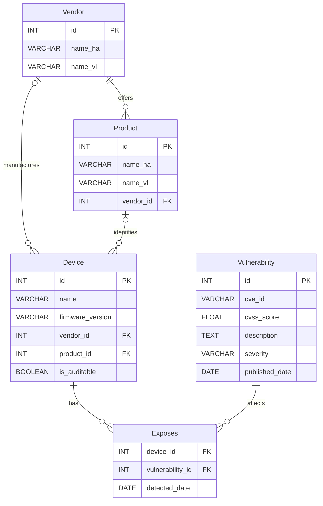

<!-- PROJECT LOGO -->
<br />
<div align="center">
  <a href="https://github.com/github_username/repo_name">
    
  </a>

<h1 align="center">IoT-VulnMap</h1>
  <p align="center">
   A threat intelligence tool that automatically detects vulnerabilities in IoT devices registered in Home Assistant
</p>
</div>


<!-- TABLE OF CONTENTS -->
<details>
  <summary>Table of Contents</summary>
</details>


<!-- ABOUT THE PROJECT -->

## About The Project

[![Product Name Screen Shot][product-screenshot]](https://example.com)

IoT devices are increasingly present in our homes, yet their security is rarely monitored. **IoT-VulnMap** bridges this
gap by connecting to a local [Home Assistant](https://www.home-assistant.io) instance, extracting the list of registered
devices, and cross-referencing them against [CIRCL's Vulnerability Lookup API](https://vulnerability.circl.lu/) to
identify known CVEs.

### Built With

[![Python][Python.org]][Python-url]

---
<!-- HOW IT WORKS -->
## How it works

The application follows a 4-step pipeline:

1. **Discovery :** <br>
2. **Normalization :** <br>
3. **Audit :** <br>
4. **Storage :** <br>

A device is considered **auditable** if it has a known vendor, a known product, and a firmware version, all successfully
mapped to CIRCL's naming convention.

### Key technical choices

#### Database schema design



#### Fuzzy matching

#### Pre-established mappings

#### Auditable vs non-auditable

<p align="right">(<a href="#readme-top">back to top</a>)</p>

---
<!-- GETTING STARTED -->

## Getting Started

This is an example of how you may give instructions on setting up your project locally.
To get a local copy up and running follow these simple example steps.

### Prerequisites

The only requirement to run this project is to have **Docker** and **Docker Compose** installed on your machine.

* Docker Compose
  ```sh
  docker compose version
  ```

### Installation

---
<!-- CONTRIBUTORS -->

## Contributors:

<!-- MARKDOWN LINKS & IMAGES -->


<!-- Shields.io badges. You can a comprehensive list with many more badges at: https://github.com/inttter/md-badges -->

[Python.org]: https://img.shields.io/badge/python-3670A0?style=for-the-badge&logo=python&logoColor=ffdd55

[Python-url]: https://www.python.org/